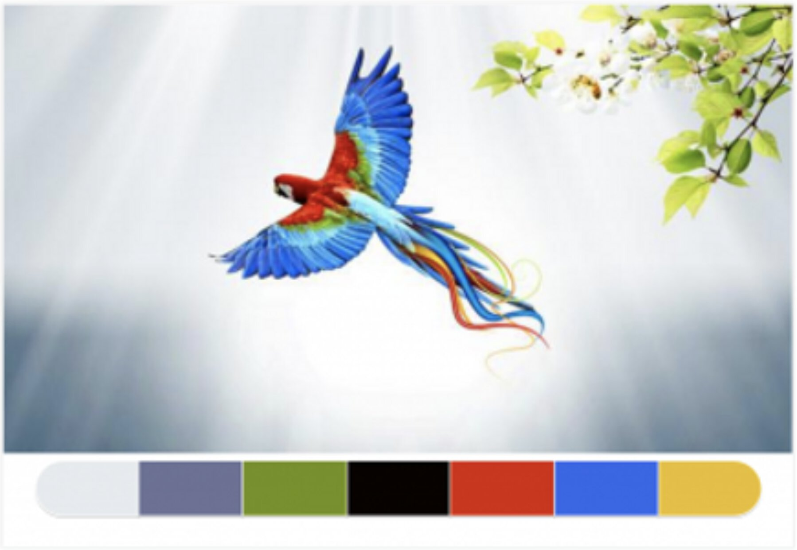

# k-means colors

Does K means on image colors produce a good palette?

## original

## rgb

k = [1 ... 12]

## hsv

k = [1 ... 12]

## Attribution

I originally saw the image on https://www.printmag.com/post/50-best-color-sites-graphic-designers. I didn't see an attribution, and Google Image searching with that image didn't turn up anything. Will add attribution / change if found.
